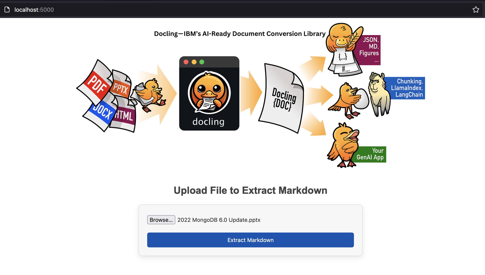

# hello-docling

Docling is an open-source Python library for efficient document conversion and analysis.

## How It Works

1. **PDF Parsing**: Extracts text tokens and renders page images
2. **AI Model Application**: Applies specialized models to each page
3. **Post-processing**: Augments metadata, detects language, corrects reading order
4. **Assembly**: Combines results into a structured document object
5. **Output**: Generates JSON or Markdown output

Docling runs entirely locally on commodity hardware, making it a powerful tool for document analysis and conversion without relying on external services.

## Key Features

### 1. PDF Conversion
- Converts PDF documents to JSON or Markdown format
- Fast and stable processing

### 2. Advanced Layout Analysis
- Utilizes AI models (DocLayNet) for detailed page layout understanding
- Recovers reading order and document structure

### 3. Table Structure Recognition
- Employs TableFormer AI model to extract and reconstruct table structures

### 4. Metadata Extraction
- Automatically extracts document metadata:
  - Title
  - Authors
  - References
  - Language

### 5. OCR Capability
- Optional OCR for scanned PDFs

### 6. Post-processing
- Removes overlapping bounding-box proposals
- Intersects predictions with text tokens for complete content units

### 7. Integration
- Works with Quackling for optimized vector embedding and chunking
- Compatible with LLM frameworks like LlamaIndex
